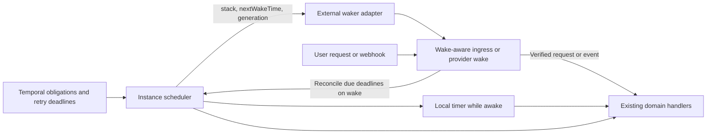

# Instance sleep and scheduler inventory

Date: 2026-10-08

Status: Inventory with first delivery-coordinator implementation; full idle sleep remains open

Code baseline: `0ac194450`

Paperclip should release idle database connections and allow inactive customer
instances to sleep without losing scheduled work, incoming events, accounting,
or recovery. Thousands of individually hosted instances make empty polling a
material cost even when each query is cheap.

**Architectural direction: triage each loop before choosing its replacement.**
Work caused by a committed change or incoming event should run from that event.
Work caused by the passage of time belongs in one in-process, instance-wide
scheduler. A later external-waker adapter publishes only the stack's next wake
time. Routine definitions and execution decisions remain inside the stack.

Immediate delivery does not have to pass through the scheduler. Its delayed
retry does. The same service can contain both categories; classify its work
paths rather than treating its current polling loop as one indivisible job.

The database already closes idle pooled connections after 60 seconds and opens
new connections on demand. The primary work is eliminating unnecessary queries
and coordinating background work, connections, and hosting sleep.

## First slice: explicit delivery notifications and shared scheduling

This implementation covers the normal dispatch of five existing durable queues:

- [x] JOB-04: feedback export enqueue nudges the app-owned delivery worker after commit.
- [x] JOB-22: task status updates use existing explicit post-commit actions to nudge completion delivery. Existing activity notifications remain an additional fast path.
- [x] JOB-23: the connection-intent resolver nudges continuation delivery after commit.
- [x] JOB-25: the answer resolver nudges response delivery after commit.
- [x] JOB-24: receipt insertion and review resolution nudge tool-action delivery after commit.
- [x] One in-process work scheduler owns the five queues' retry deadlines and shared recovery deadline, with one timer and an inspectable earliest deadline.
- [x] Real PostgreSQL producer/delivery tests and deterministic scheduler tests cover commit boundaries, restart recovery, missed notifications, concurrent nudges, retry, drain/standby, and awaited shutdown.
- [ ] Prove a complete writer-admission and idle/resume boundary before disabling shared recovery while quiet.
- [ ] Migrate other actual scheduled work and expose the whole instance's earliest deadline to an external waker.
- [ ] Verify actual app and database sleep on the hosting providers.

The existing delivery rows remain authoritative. No new tables, schema changes,
database transaction wrappers, or permanent uncertain-commit holds are introduced.
Notifications use the root database object only as an in-memory instance identity;
they do not query it or modify its methods. A service constructed with a caller's
transaction cannot notify a root subscriber itself. The transaction owner must
flush its explicit post-commit effects; scheduled recovery covers omitted effects,
other writers/replicas, and failures after a commit that lose the acknowledgement.

Normal dispatch is event-driven. Empty queues no longer own five-second or
heartbeat-cadence polling. A shared **60-second recovery pass is intentionally
retained**, including when the process has no user activity, until the idle
boundary is proven. Outstanding deliveries and errors retain the existing retry
cadence (five seconds for feedback, heartbeat interval for the other queues).
A blocked sweep does not issue SQL during warm standby or idle drain; admission
is checked again before each run. Shutdown cancels deadlines and awaits active
sweeps. Feedback uploads have a 30-second deadline and accept shutdown
cancellation; unstarted exports stay pending. Vote routes return after saving
and notifying, without waiting for uploads. Pending tool receipts include reviews awaiting a later terminal status.

This is a prerequisite for sleep, not proof of a sleeping stack. The scheduler's
`nextWakeAt` covers only these registered tasks, not every existing application
loop. Database pool lifecycle, provider sleep, the final idle reconciliation, and
external wake registration remain separate work. Unknown commits are recovered
by the retained sweep; this change does not establish a new sleep-safety proof.

Implementation: `server/src/services/work-scheduler.ts`,
`delivery-work-coordinator.ts`, and `delivery-work-notifications.ts`.

## Using this checklist

Items have stable IDs so they can become separate issues or PRs. All boxes start
unchecked: an existing mechanism or a recommendation is not proof that the
sleep journey has passed. Mark an item complete only after its completion
criteria have evidence, and append the issue/PR and verification result to it.
Record deferrals with a reason and the capability that must remain awake.

Source links identify files in the audited revision. Function names and stated
cadences are navigation aids; recheck them when implementing a later revision.
Cadences describe ordinary claimed-instance operation. Warm-standby, idle-drain,
configuration, or feature gates can suppress individual paths. This inventory
does not establish the actual deployed fleet configuration.

## Triage before implementation

Use this question for every operation: **If no new request or event arrives,
does this operation still need to happen at a particular future time?**

- **Yes: clock-driven.** Register that deadline with the internal scheduler.
  Examples are a routine at 09:00, a retry after backoff, and a session expiry.
- **No: event-driven or on demand.** Invoke it from the owning committed mutation,
  verified external event, or user request. An empty queue is not a scheduled
  task. Examples are delivering a newly committed answer and refreshing a UI
  after an issue changes.

Many existing sweeps combine both. Separate their immediate dispatch from their
retry/timeout/recovery paths. Persistent transports and active-operation
keepalives are lifecycle requirements, not idle business schedules; their
ownership and shutdown need separate treatment.

The tables below are a first-pass mechanism triage grounded in the inventory.
They select where to investigate first, not permission to delete a recovery
path. Detailed checklist items remain the implementation and verification record.

### Work that genuinely needs a clock

| Checklist items | Reason time matters | What belongs in the scheduler |
| --- | --- | --- |
| JOB-08 Agent timer heartbeats and issue monitors | The user explicitly requested future checks. | The next enabled heartbeat/monitor deadline; none when unconfigured. |
| JOB-09 Routine cron triggers | A routine must run even without new incoming activity. | Existing `nextRunAt`, retaining catch-up and timezone semantics. |
| JOB-07 Plugin scheduled jobs | A plugin may declare real recurring work. | Declared job deadlines; plugin load/configuration events update registration. |
| JOB-29 Backups | A backup guarantee has a time requirement. | The next backup if this instance owns it; otherwise the explicit external backup owner. |
| JOB-18, JOB-19 Login and setup expiry | An abandoned session/resource must expire even if nobody returns. | Actual expiry and failed-cleanup retry times, only while relevant sessions exist. |
| JOB-11, JOB-21 Decision and secret/token expiry | Decision deadlines and some deletion/retention obligations are time-based. | Required expiry/scrub deadlines. Check validity synchronously on use regardless of whether physical cleanup ran. |
| JOB-10 Decision retention | An unchanged item can become old enough to archive. | The next actual retention deadline; immediate change handling and notification delivery are event-driven. |
| JOB-12, JOB-13 External objects and status cards | Some configured freshness/update policies require future work. | Only time-based refresh/evaluation deadlines; reactive updates use events. |
| JOB-27, JOB-28 Retries and watchdogs | A retry delay or absence of expected progress can itself require action. | Concrete retry, lease-expiry, monitor, or watchdog deadlines for existing work. |

### Work whose normal path should stop polling

| Checklist items | Preferred normal trigger | Clock-driven remainder or qualification |
| --- | --- | --- |
| JOB-04 Feedback exports | Committed export enqueue. | Backoff after delivery failure and durable recovery of outstanding exports. No empty five-second scan. |
| JOB-22 Chat completion delivery | Committed task completion/update. An existing postcommit fast path is already present. | Delivery retries and recovery; the current fast path is best-effort, so prove replacement reliability before removing its sweep. |
| JOB-23 Connection continuation delivery | Committed connection availability/change and pending continuation enqueue. | Failed-delivery retry/claim recovery. |
| JOB-25 Question response delivery | Committed user answer. | Retry/claim expiry while delivery is outstanding. |
| JOB-24 Tool action reviews and deliveries | Committed approval/rejection or action enqueue. | Review expiry and delivery retries. |
| JOB-26 Cost accounting | Arrival or durable capture of a usage receipt/result. | Recovery of unresolved receipts/reservations and failed writes. Accounting debt cannot be dropped. |
| JOB-05 MCP and Dot events | Committed source event or subscription change. | Delivery retries and required expiry cleanup. |
| JOB-01 Chat reconciliation | Incoming message, committed publication, or endpoint configuration change. | Split its lanes: delivery retry and missed-event recovery are temporal; socket ownership is NET work. |
| JOB-02 Email reconciliation | Verified webhook, outgoing send, or endpoint configuration change. | Retry and provider catch-up guarantees; socket reception and catch-up are NET-01/NET-02. |
| JOB-03 Browser-use cleanup | Browser/session lifecycle change. | Register actual idle/expiry/reconciliation deadlines while sessions exist; active leases remain protected. |
| JOB-06 Execution-control reconciliation | Execution state transitions and committed control requests. | Timeout, lease-expiry, abandoned-operation, and failed-delivery recovery. Split the lanes before changing cadence. |
| JOB-14 GitHub events and continuity | Verified webhook and connection lifecycle change where supported. | Credential deadlines; bounded polling only for providers/events without adequate push or replay guarantees. |
| JOB-15 Merge confirmations | Verified merge event for an outstanding candidate. | Bounded fallback only while candidates exist and webhook/replay coverage is insufficient. |
| JOB-16 Terminal workspaces | Committed terminal task/tree transition. | Cooldown, failed-cleanup retry, and recovery of outstanding cleanup. |
| JOB-17 Sandbox cleanup | Resource release or failed acquire/release. | Retry/backoff and provider/fleet orphan recovery. |
| JOB-20 Connection health | Use of the connection or configuration change. | Proactive checks only where a defined freshness guarantee requires them. |
| JOB-10, JOB-11 Decision effects and notifications | Committed decision/relevant source mutation. | Expiry/retention stays in the clock-driven category. |
| JOB-12, JOB-13 Reactive external objects/cards | Verified provider event or relevant local mutation. | Configured time-based refresh stays in the clock-driven category. |
| JOB-27, JOB-28 Queued runs, assignments, and dependencies | Committed enqueue, assignment, terminal result, or dependency transition. | Time-based recovery/watchdogs stay in the clock-driven category. |
| AUX-01, AUX-03 Telemetry and plugin log flushing | First buffered entry activates a bounded flush. | Batch delay and failed-delivery retry while nonempty; no empty heartbeat. |
| AUX-04 Import spools and runtime status expiry | Spool creation/completion, startup, or access to an expiring in-memory value. | Schedule only required file-retention/cleanup deadlines. Lazy expiration can handle noncontractual memory cleanup. |
| UI-01, UI-02 Stable UI data | Existing live events, initial read, foreground return, and reconnect reconciliation. | Preserve bounded fallback during a genuine realtime outage or active operation. Reconcile subscription gaps because live events are not replayed. |
| UI-03, UI-04, UI-06 Recovery, app updates, and setup | Foreground/online/user activity and bounded setup state. | Client-side retry/update deadlines where needed; these do not become tenant server jobs. |

JOB-30 is removal of the aggregate polling wrapper after its constituents are
handled, not a new scheduled job. DB-01–DB-03 concern the connection pool;
DB-04/DB-05 concern probes. NET-01–NET-07, UI-05, and AUX-05 concern transport or
plugin lifetime. AUX-02/AUX-06 require checking actual exporter/SDK traffic.
SCH, WAKE, SAFE, HOST, and TEST items are infrastructure, policy, or verification
work rather than business jobs. This keeps every inventory item accounted for
without making the scheduler responsible for every source of activity.

### Qualification before removing a poll

- [ ] **TRI-01 — Identify the real trigger and every producer.** For each
  event-driven candidate, list the committed mutations/external events that
  create work, including alternate API paths and recovery writers. **Complete
  when:** every supported producer has an owned dispatch path and the service
  needs no scan to discover normal new work.

- [ ] **TRI-02 — Separate first delivery from delayed recovery.** Record which
  paths are immediate, which have a concrete due time, and which depend on an
  external provider's push capabilities. **Complete when:** each migrated lane
  has an explicit trigger and its remaining deadlines are enumerated.

- [ ] **TRI-03 — Prove durable delivery before retiring its backstop.** A
  best-effort callback after commit is not a durable queue consumer. Cover
  commit-before-signal crashes, lost signals while the process stays alive,
  handler failures, concurrent producers, and restart. **Complete when:** an
  outstanding record cannot become invisible indefinitely. Retain a bounded,
  explicitly justified reconciliation path until this is proven; document its
  wake cost rather than assuming startup recovery covers every failure.

- [ ] **TRI-04 — Order work by avoidable idle traffic and migration risk.**
  Record expected idle SQL/network reduction and the smallest focused proof for
  the next item. **Complete when:** the next PR has one clear boundary and does
  not require the entire scheduler or all connector lifecycles to be finished.

### Initial implementation shortlist

1. **DB-04/DB-05: health and probe separation.** A self-contained source of
   avoidable demand, independent of building a scheduler. Verify actual callers
   so the new endpoint is used.
2. **JOB-04: event-driven feedback exports.** A contained first dispatch
   migration. Triage its enqueue, failed-export behavior, and recovery first;
   put only actual retry/batch deadlines in scheduling infrastructure.
3. **JOB-22/JOB-25: completion and answer delivery.** Reuse existing postcommit
   paths where possible, after proving that durable delivery can replace the
   sweep rather than merely supplement it.
4. **JOB-01/JOB-02/JOB-03: frequent empty chat, email, and browser scans.** Large
   baseline benefit, but split the component lanes and preserve configured
   transports, expiry, and recovery. Resource absence must be invalidated when
   a new resource is committed.
5. **SCH with JOB-09: routine scheduling as the first true clock-driven slice.**
   Existing `nextRunAt` makes the real scheduler requirement concrete. Add other
   temporal paths and then the external-waker adapter.

This order supersedes starting by routing the feedback polling loop through a
generic scheduler. Event-driven improvements can ship before that scheduler is
complete. The resulting service still needs an owned way to retry failures.

## Provider behavior and cost model

| Layer | Documented behavior | Consequence |
| --- | --- | --- |
| Neon | Normally suspends after five minutes without active queries. Idle-in-transaction connections count as active; ordinary idle connections do not necessarily block suspension. New connection requests can reset inactivity. | Stop empty SQL polling and connection churn; do not force-close active transactions. |
| Railway | Detailed Serverless documentation specifies five minutes without outbound packets, sampled so actual sleep is roughly 5–10 minutes. Private-network traffic and responses count. Enabling Serverless requires a deployment to affect the container. | Every recurring source of packets matters. Even a DB-free endpoint can keep the app awake when repeatedly called externally. |
| Unikraft | `on` waits for connections/HTTP requests to finish; `idle` can suspend inactive TCP connections. Active HTTP requests prevent suspension. Stateful mode resumes a snapshot. | Quiesce connections deliberately and explicitly protect background work from premature suspension. |

Provider sources: [Neon compute lifecycle](https://neon.com/docs/introduction/compute-lifecycle),
[Neon compute management](https://neon.com/docs/manage/endpoints/),
[Railway Serverless](https://docs.railway.com/deployments/serverless),
[Unikraft scale to zero](https://unikraft.com/docs/features/scale-to-zero).

Neon usage is reported in CU-seconds. The transcript's five-minute concern is
primarily an idle-timeout cost, not a universal billing quantum. With a
five-minute timeout, a trivial hourly check creates roughly an 8.3% active-time
floor before useful work; checking every five minutes can leave compute
continuously active. This illustration assumes the default timeout and excludes
other traffic, processing time, and storage charges. Verify actual endpoint
settings and the applicable plan. See [Neon usage calculations](https://neon.com/docs/introduction/usage-calculations).

## 1. Internal scheduler for true deadlines

- [ ] **SCH-01 — Establish the instance-wide scheduler boundary.** Route
  application-owned delayed jobs, recurring jobs, retry deadlines, and required
  expiry/cleanup/maintenance deadlines through one scheduler shared across all
  companies. Immediate event/queue dispatch remains in its owning service;
  running-work tracking is shared with sleep admission. Keep domain handlers and
  their authorization/atomic claims in their existing services. **Complete
  when:** one scheduling interface supports true temporal obligations, company
  scope remains explicit, and self-hosted operation requires no external service.

- [ ] **SCH-02 — Model work and deadlines explicitly.** Track a stable job/lane
  identity, company scope where applicable, due time, pending/running state,
  retry policy, and whether running work blocks sleep. Accept running-work
  information from event-driven handlers without forcing their dispatch through
  the scheduler. Distinguish scheduled
  work, immediate queued work, waiting for an external event, and passive
  configuration/history. **Complete when:** an empty lane has no recurring SQL
  check, and the scheduler can explain outstanding work and the earliest due
  time without querying the database on every timer tick.

- [ ] **SCH-03 — Reconstruct state and handle committed changes.** Seed the
  scheduler from existing durable domain records on startup; use committed
  mutations to register, reschedule, cancel, or activate work. In-memory hints
  cannot be the sole record of an obligation. Define how all supported writers
  invalidate hints; initially retain the existing single-process boundary.
  **Complete when:** restart and a crash between commit and notification recover
  work, and creating an earlier deadline updates the scheduler immediately.

- [ ] **SCH-04 — Implement local scheduling and catch-up.** Arm the nearest
  necessary local timer and run due handlers with bounded concurrency and
  per-lane overlap protection. Preserve each domain's timezone, missed-run,
  coalescing, priority, and retry semantics. **Complete when:** delayed callbacks,
  clock changes, restart, and duplicate activation cannot silently lose work or
  bypass existing execution claims.

- [ ] **SCH-05 — Expose an aggregate next wake time.** Compute the earliest
  required deadline across the whole instance, including retries, cleanup,
  accounting, and maintenance. Represent no scheduled work as no alarm; represent
  unknown obligations as a sleep blocker. **Complete when:** adding, moving,
  removing, or completing the earliest item correctly changes the aggregate.

- [ ] **SCH-06 — Integrate running-work ownership and drain.** Reuse
  [task admission](../../server/src/services/task-admission.ts),
  [idle admission](../../server/src/middleware/idle-admission.ts), and the
  [existing sleep protocol](../idle-sleep-safety.md). Track handler completion
  even after an HTTP response or client disconnect. **Complete when:** draining
  prevents new scheduled admissions and waits for accepted work without losing
  fire-and-forget work or mutations racing the final check.

- [ ] **SCH-07 — Classify transport and SDK timer exceptions.** Business
  scheduling belongs to the scheduler. Protocol pings, socket deadlines, and
  active-operation lease renewals can remain local to their transports, but
  must have explicit start/stop ownership and participate in sleep blocking.
  Browser timers use a separate foreground/activity policy. **Complete when:**
  exceptions are inventoried and owned; no hidden independent timer can renew
  an idle connector indefinitely after its scheduler lane is stopped.

- [ ] **SCH-08 — Make scheduler migration incremental and observable.** Migrate
  each inventory item below independently. Report pending work, next deadline,
  active holds, and unknown/unmigrated blockers through local diagnostics.
  Avoid periodic SQL or remote reporting merely to observe inactivity.
  **Complete when:** an operator can explain why a stack is awake and a migrated
  lane can be rolled back without duplicate processing. Preserve the telemetry
  review rules if any first-party event contract changes.

## 2. External waker adapter later

The minimal external model is `(stack, nextWakeTime)`. Operational delivery may
also carry a generation/idempotency value and delivery status. It must not
require copying every routine, agent configuration, or permission into Cloud.
The internal scheduler remains authoritative about what to execute.

- [ ] **WAKE-01 — Define the adapter and local-only behavior.** Support
  setting/replacing and cancelling the next alarm. No external adapter is
  required to use the internal scheduler. **Complete when:** timed work remains
  local and the instance remains awake if no durable external wake is available;
  introducing the internal scheduler alone never authorizes sleeping through a
  deadline.

- [ ] **WAKE-02 — Make alarm publication durable and acknowledge it before sleep.**
  Persist publication intent/generation or use an equivalent recoverable
  handshake. Recheck that the acknowledged alarm still covers the earliest
  deadline before sleeping. **Complete when:** failure, lost responses, and a
  concurrently moved-earlier deadline keep the instance awake until covered;
  local scheduling continues during external-waker outages.

- [ ] **WAKE-03 — Handle duplicate, stale, delayed, and missed wake delivery.**
  Fence stale generations, retry failed delivery, reconcile due work after
  wake, and retain domain-level atomic claims. **Complete when:** a repeated
  doorbell does not duplicate work, and missed deadlines follow each domain's
  explicit catch-up policy. Do not claim exactly-once network delivery.

- [ ] **WAKE-04 — Serialize ingress, sleep, deploy, and wake.** Buffer or retry
  incoming requests while draining; authenticate external control and preserve
  webhook verification and acknowledgement deadlines. The host must bind its
  final stop decision to the correct process/provider generation. **Complete
  when:** requests arriving during sleep entry are neither lost nor admitted
  into a process being stopped. Multi-replica support requires shared fencing.

- [ ] **WAKE-05 — Implement and qualify provider adapters.** Evaluate Unikraft
  scheduled `start` operations and a shared durable delayed-delivery mechanism
  for Railway. Verify that provider resume actually invokes due-work processing,
  including stateful resume without process startup. **Complete when:** an
  isolated instance wakes for its earliest deadline and no waker polls sleeping
  tenant databases. See [Unikraft scheduled wake-ups](https://unikraft.com/docs/features/cron-jobs).

- [ ] **WAKE-06 — Protect active background execution on the host.** Connect
  active-work holds to the provider's sleep controls. Unikraft exposes a
  reference-counted disable mechanism; account for its signal delay. **Complete
  when:** startup, transactions, agent control, finalization, and cleanup cannot
  be suspended halfway through accepted work. See [Unikraft application sleep controls](https://unikraft.com/docs/tutorials/scale-to-zero-triggers).

- [ ] **WAKE-07 — Validate wake concentration and cost.** Capacity-test concurrent
  scheduled wakes, apply bounded dispatch, and use jitter only where semantics
  permit. **Complete when:** scheduler backlog/delivery delay is observable and
  a midnight burst does not silently skip customer jobs. Avoid periodically
  waking all tenants just to discover whether any work exists.

## 3. Database and health

- [ ] **DB-01 — Qualify the existing idle pool behavior.**
  [client.ts](../../packages/db/src/client.ts) already defaults
  `DATABASE_IDLE_TIMEOUT_SECONDS` to 60; `0` disables reaping. Keep the existing
  Drizzle handle and lazy reconnection; evaluate 30 seconds after pollers become
  quiet. **Complete when:** idle connections disappear and a subsequent read,
  write, and transaction work after actual provider suspension without per-route
  lifecycle code. Existing tests are in
  [client.test.ts](../../packages/db/src/client.test.ts).

- [ ] **DB-02 — Preserve disconnect and transaction safety.** `.end()` permanently
  shuts down the pool and must not become an idle operation. Reconnection does
  not authorize replaying an interrupted write. **Complete when:** existing
  transaction isolation after disconnect and explicitly idempotent retry rules
  still hold; ambiguous commits are not blindly replayed. See
  [database retry behavior](../DATABASE.md#connection-loss-and-retries).

- [ ] **DB-03 — Cover every client and socket.** Better Auth shares the main DB;
  the optional plugin migration pool uses the same idle configuration. Utility,
  backup, and dedicated advisory-lock connections are bounded work. The audited
  postgres.js version has a 60-second TCP keepalive; keepalive is not SQL.
  **Complete when:** all pools can reach zero when idle, reserved/active work is
  protected, and no new persistent LISTEN or health-ping connection is introduced
  as a substitute for polling. Sources:
  [DB client](../../packages/db/src/client.ts),
  [auth adapter](../../server/src/auth/better-auth.ts),
  [backup library](../../packages/db/src/backup-lib.ts).

- [ ] **DB-04 — Split process liveness from DB readiness.** Claimed-instance
  [health](../../server/src/routes/health.ts) executes `SELECT 1`; auth and deep
  checks may perform additional queries. Install cheap liveness before session
  and actor resolution. **Complete when:** normal liveness produces no SQL,
  explicit deep readiness still tests DB health, and signed claim/bootstrap
  mutations retain their existing validation and tracking.

- [ ] **DB-05 — Audit external probes and configured endpoints.** Inspect the
  fleet gateway, uptime monitors, deployment checks, DB pool settings, and Neon
  suspend configuration. The [ECS example](../../docker/ecs-task-definition.json)
  probes every 30 seconds; it is not evidence of Railway fleet behavior.
  **Complete when:** sleeping is an expected state, repeated checks do not wake
  tenants or reconnect to Neon, and readiness errors remain distinguishable
  from intentional sleep. Railway's built-in health checks are deployment-only:
  [provider documentation](https://docs.railway.com/deployments/healthchecks).

## 4. Server scheduling migration inventory

Apply the triage above to each operation within these services. Remove polling
from event-driven normal paths and route only real deadlines through the internal
scheduler. Preserve durable delivery, startup recovery, and domain-level claims.
Longer polling intervals alone do not complete an item.

- [ ] **JOB-01 — Chat reconciliation.** Current: every **1s**, with multiple
  runtime/delivery/publication lanes and SQL even without connectors. Change:
  disarm empty lanes and activate on committed events or deadlines. **Complete
  when:** a tenant with no chat obligations issues no chat SQL and new inbound,
  publication, and recovery work still runs. Sources:
  [app.ts](../../server/src/app.ts),
  [chat-channels.ts](../../server/src/services/chat-channels.ts).

- [ ] **JOB-02 — Email reconciliation.** Current: every **1s**, querying active
  endpoints even when none exist. Change: initialize resource/pending state and
  update on endpoint changes, webhook receipt, sends, and retries. **Complete
  when:** empty mail state produces no polling SQL and new work activates the
  worker without restart. Source:
  [email-channels.ts](../../server/src/services/email-channels.ts).

- [ ] **JOB-03 — Browser-use cleanup.** Current: every **3s** with due-session
  queries even when empty. Change: register actual session reconciliation/expiry
  deadlines. **Complete when:** no sessions means no queries, while active leases,
  expiry, and failed cleanup remain recoverable. Sources:
  [app.ts](../../server/src/app.ts),
  [browser-use.ts](../../server/src/services/browser-use.ts).

- [ ] **JOB-04 — Feedback exports.** Current: every **5s**, querying the queue
  even without a configured share client. Change: committed enqueue signals and
  durable retries. **Complete when:** empty exports are quiet and queued exports
  survive restart and temporary delivery failure. Sources:
  [app.ts](../../server/src/app.ts),
  [feedback.ts](../../server/src/services/feedback.ts).

- [ ] **JOB-05 — Public MCP and Dot event dispatch.** Current: **2s** per started
  dispatcher, including SQL-backed enablement, expiry, and delivery scans.
  Change: cache capability state and schedule delivery/retry/expiry work.
  **Complete when:** disabled/empty dispatchers are DB-free and pending events
  retain subscription scope, expiry, and replay safety. Source:
  [events.ts](../../server/src/services/public-mcp/events.ts).

- [ ] **JOB-06 — Execution-control reconciliation.** Current: independent
  **15s** recovery/delivery lanes, including when the main heartbeat is disabled.
  Change: activate lanes from durable pending work and deadlines. **Complete
  when:** empty lanes are quiet and abandoned finalizations, replacements,
  continuations, status/disposition delivery, and login expiry still recover.
  Sources: [index.ts](../../server/src/index.ts),
  [execution-control-deadline.ts](../../server/src/services/execution-control-deadline.ts).

- [ ] **JOB-07 — Plugin job scheduling.** Current: **30s** SQL even without jobs.
  Change: register nearest `nextRunAt` and signal registration/update/removal.
  **Complete when:** empty plugins/jobs produce no scheduler SQL and due jobs
  retain atomic ownership. The plugin job coordinator itself is event-driven,
  not another periodic loop. Sources:
  [plugin-job-scheduler.ts](../../server/src/services/plugin-job-scheduler.ts),
  [plugin-job-coordinator.ts](../../server/src/services/plugin-job-coordinator.ts).

- [ ] **JOB-08 — Agent timer heartbeats and issue monitors.** Current: **30s**
  agent/monitor scans; agent-level disabled heartbeats still require discovery.
  Change: register each relevant deadline and aggregate locally. **Complete
  when:** no timer work means no queries, and due work preserves pause, budget,
  authorization, and atomic wake admission. Source:
  [heartbeat.ts](../../server/src/services/heartbeat.ts), `tickTimers`.

- [ ] **JOB-09 — Routine cron triggers.** Current: **30s** due-trigger query.
  Change: use existing `nextRunAt` in the internal scheduler. **Complete when:**
  timezone, catch-up/coalescing, concurrency, project pause, edits, and deletion
  behave correctly; external waking can be added without relocating routines.
  Source: [routines.ts](../../server/src/services/routines.ts), `tickScheduledTriggers`.

- [ ] **JOB-10 — Decision retention and notifications.** Current: every **30s**,
  builds the complete attention feed for each active company before archiving
  and delivering notifications. Change: relevant mutation signals, actual
  retention deadlines, and batched maintenance. **Complete when:** unchanged
  idle companies do not rebuild feeds and required archive/notification behavior
  remains timely. Source: [index.ts](../../server/src/index.ts), `runRetentionSweep`.

- [ ] **JOB-11 — Decision expiry and recovery.** Current: **30s** scans for stuck
  effects, continuations, and TTLs. Change: schedule their actual deadlines and
  signal committed effects. **Complete when:** expiration remains authoritative
  at action time and interrupted effects recover without perpetual empty scans.
  Source: [decisions.ts](../../server/src/services/decisions.ts), `sweepExpired`.

- [ ] **JOB-12 — External-object refresh.** Current: **30s** scans, including a
  DB feature check when disabled. Change: invalidate cached capability on settings
  changes; register `nextRefreshAt`; use webhook signals where supported.
  **Complete when:** disabled/empty state is quiet and promised refresh freshness
  has an owned deadline. Sources:
  [external-objects.ts](../../server/src/services/external-objects.ts),
  [instance-settings.ts](../../server/src/services/instance-settings.ts).

- [ ] **JOB-13 — Status-card evaluation.** Current: **30s**, including a DB
  feature check when disabled. Change: register `nextEvalAt` and relevant event
  invalidations. **Complete when:** no capability/due cards means no queries,
  and evaluation preserves existing assignment and cancellation behavior.
  Source: [status-cards.ts](../../server/src/services/status-cards.ts).

- [ ] **JOB-14 — GitHub events and connection continuity.** Current: **30s**
  connection scans; provider calls depend on configured/due work. Change:
  webhook-first activation plus explicit poll fallback, credential, and retry
  deadlines. **Complete when:** empty state is quiet and configured connections
  retain their delivery and continuity guarantees. Source:
  [index.ts](../../server/src/index.ts), `scheduleGitHubConnectionEventPoll` and
  `scheduleGitHubConnectionContinuitySweep`.

- [ ] **JOB-15 — Merged pull-request confirmations.** Current: **30s** pending
  confirmation scan, followed by GitHub checks for matching candidates. Change:
  activate on merge events with bounded polling fallback only while candidates
  exist. **Complete when:** confirmation resolution remains authorized and
  restart-safe, with no empty scan. Source:
  [issue-thread-interactions.ts](../../server/src/services/issue-thread-interactions.ts).

- [ ] **JOB-16 — Terminal workspace cleanup.** Current: **30s** candidate scans.
  Change: enqueue from terminal transitions and cooldown deadlines. **Complete
  when:** empty state is quiet, and cleanup still checks current task state,
  artifacts, deliveries, and ownership before deleting resources. Source:
  [execution-workspaces.ts](../../server/src/services/execution-workspaces.ts).

- [ ] **JOB-17 — Sandbox cleanup and orphan spools.** Current: **30s** scans even
  when attempts have longer staleness/backoff. Change: durable cleanup queue with
  next retry, immediate failed-release activation, and provider/fleet backstop.
  **Complete when:** idle scans stop without leaking paid sandboxes or ignoring
  malformed/unpersisted spool entries. Source:
  [heartbeat.ts](../../server/src/services/heartbeat.ts), `sweepPendingCleanupLeases`.

- [ ] **JOB-18 — Adapter login and setup-token reapers.** Current: **30s**
  durable-session/lease scans, alongside local one-shot timers. Change: register
  actual expiry and cleanup retry times. **Complete when:** abandoned logins and
  interrupted teardown still release sandboxes across restart, without scans
  when no obligations exist. Source:
  [index.ts](../../server/src/index.ts), adapter and setup-token reaper wiring.

- [ ] **JOB-19 — Custom-image setup expiry.** Current: **30s** active-session
  expiry scans. Change: register `expiresAt` and cleanup attempts. **Complete
  when:** no sessions means no SQL and expired provider resources are released.
  Source: [environment-custom-images.ts](../../server/src/services/environment-custom-images.ts).

- [ ] **JOB-20 — Tool connection health.** Current: **30s** DB inventory;
  provider probes are conditional. Change: check on use/configuration change,
  with explicit deadlines for any promised proactive health checks. **Complete
  when:** quiet connections stop creating empty scans and failures remain
  visible within the agreed freshness contract. Source:
  [index.ts](../../server/src/index.ts), `tools.sweepConnectionHealth`.

- [ ] **JOB-21 — Secret proposals and expired action tokens.** Current: **30s**
  expiry/cleanup queries. Change: enforce expiry synchronously on use and
  register required scrub/cleanup deadlines. **Complete when:** idle cleanup
  does not extend authorization or secret-retention periods. Sources:
  [secret-proposals.ts](../../server/src/services/secret-proposals.ts),
  [index.ts](../../server/src/index.ts).

- [ ] **JOB-22 — Chat completion delivery.** Current: **30s** outbox scan plus
  an existing postcommit fast path. Change: extend that signal and register
  retries only while pending. **Complete when:** committed completions survive
  restart, duplicate activation, and provider failure without empty polling.
  Source: [index.ts](../../server/src/index.ts).

- [ ] **JOB-23 — Connection continuation delivery.** Current: **30s** outbox
  scans. Change: committed signals, retry deadlines, and startup reconciliation.
  **Complete when:** newly available connections resume eligible work once,
  preserve execution gates, and have no empty SQL loop. Source:
  [index.ts](../../server/src/index.ts).

- [ ] **JOB-24 — Tool action reviews and deliveries.** Current: **30s**
  review/session/outbox scans. Change: register review expiry and delivery
  deadlines; activate after committed decisions. **Complete when:** approval,
  rejection, expiry, and delivery retain authorization and replay protection.
  Source: [index.ts](../../server/src/index.ts).

- [ ] **JOB-25 — Question response delivery.** Current: **30s** outbox scans.
  Change: committed-answer activation, durable retry deadlines, and startup
  recovery. **Complete when:** responses preserve attempt-generation fencing
  and recover from delivery failure without polling empty queues. Source:
  [question-response-delivery.ts](../../server/src/services/question-response-delivery.ts).

- [ ] **JOB-26 — Cost accounting and decision-model recovery.** Current:
  **30s** reconciliation even when empty. Change: pending-receipt signals,
  spool awareness, and durable retries. **Complete when:** no empty queries,
  but unresolved receipts/reservations remain tracked and cannot be discarded
  to permit sleep. Source: [heartbeat.ts](../../server/src/services/heartbeat.ts),
  `reconcileCostAccounting`.

- [ ] **JOB-27 — Run recovery, scheduled retries, and queued work.** Current:
  **30s** orphan/retry/queue/stranded-assignment scans. Change: remain responsive
  while work exists, register retry/control deadlines, and reconcile on startup
  or wake. **Complete when:** quiet state has no scans and interrupted runs do
  not duplicate provider work or lose continuation. Source:
  [index.ts](../../server/src/index.ts), periodic heartbeat recovery chain.

- [ ] **JOB-28 — Dependencies, task watchdogs, silent runs, and stale locks.**
  Current: additional **30s** scans. Change: dependency/run transition signals,
  active-run-only monitoring, actual timeout deadlines, and startup backstops.
  **Complete when:** recovery remains scoped and fenced, and a completed task
  still receives any owed watchdog review. Source:
  [heartbeat.ts](../../server/src/services/heartbeat.ts).

- [ ] **JOB-29 — Automatic database backups.** Current: enabled by default,
  typically **hourly**, with separate dump connections. Change: register with
  the internal scheduler; later assign durable waking or explicitly transfer
  backup responsibility to managed infrastructure. **Complete when:** backup
  and restore guarantees are demonstrated, active backup blocks sleep, and a
  merely configured future backup no longer blocks indefinitely once covered
  by an external alarm. Source: [index.ts](../../server/src/index.ts).

- [ ] **JOB-30 — Replace the main tick and its disabled branch.** Current:
  default **30s** main tick; setting `HEARTBEAT_SCHEDULER_ENABLED=false` still
  leaves accounting, external-object, cleanup, and GitHub work, plus independent
  workers. Change: migrate all lanes before retiring aggregate polling.
  **Complete when:** disabled scheduling semantics remain documented and no
  legacy fallback quietly reintroduces recurring SQL. Sources:
  [index.ts](../../server/src/index.ts), [config.ts](../../server/src/config.ts).

## 5. Connectors and transport lifetime

- [ ] **NET-01 — AgentMail socket ownership.** Current: outbound WebSocket and
  **20s** DB lease renewal; its renewal bypasses the top-level background gate.
  Change: prefer webhook mode for hosted stacks; otherwise retain an awake
  receiver or use shared durable ingress. **Complete when:** explicit suspend
  closes all associated timers and message reception/replay still works.
  Source: [email-channels.ts](../../server/src/services/email-channels.ts).

- [ ] **NET-02 — AgentMail catch-up.** Current: roughly **one-minute** provider
  reconciliation even in webhook mode. Change: catch up on wake/connect and at
  an owned recovery deadline. **Complete when:** checkpoints and deduplication
  survive lost webhooks, with a defined maximum recovery delay. Source:
  [email-channels.ts](../../server/src/services/email-channels.ts).

- [ ] **NET-03 — Discord Gateway.** Current: persistent connection and **5s** DB
  ownership renewal. Change: keep unsupported stacks awake initially; evaluate
  a shared ingress worker owning the connection, lease, and durable delivery.
  **Complete when:** idle tenant sleep does not silently stop timely reception
  or weaken ownership fencing. Sources:
  [chat-channels.ts](../../server/src/services/chat-channels.ts),
  [chat-sdk-runtime.ts](../../server/src/services/chat-sdk-runtime.ts).

- [ ] **NET-04 — Photon iMessage.** Current: several gRPC subscriptions, **5s**
  ownership renewal, and **15s** catch-up. Change: explicit transport lifecycle
  and, where required, shared durable receiving. **Complete when:** resume
  preserves ordered checkpoints and detects replay/history gaps; stopping the
  top-level chat loop also retires dependent work safely. Source:
  [receiver.ts](../../server/src/services/photon/receiver.ts).

- [ ] **NET-05 — Slack webhook ingress.** Current transport already uses webhook
  mode. Change: qualify it through wake-aware ingress rather than introducing
  a persistent receiver. **Complete when:** cold start meets provider timing
  through durable acknowledgement/retry where necessary, with signature
  verification, deduplication, and company scope preserved. Source:
  [chat-sdk-runtime.ts](../../server/src/services/chat-sdk-runtime.ts).

- [ ] **NET-06 — HTTP idle connections.** Current server keepalive is **185s**
  to outlive common proxy defaults. Change: explicitly close idle sockets during
  drain and qualify provider-specific connection policies. **Complete when:**
  quiet sockets do not prevent intended sleep, and normal proxy reuse does not
  gain intermittent 502/ECONNRESET failures. Source:
  [index.ts](../../server/src/index.ts).

- [ ] **NET-07 — Active execution transports and lease renewals.** Inventory
  runner/PRP connections, HTTP/2 bridge pings, native/legacy controller leases,
  terminal SSH keepalives, browser viewport ownership, and per-operation claims.
  Retain their required cadence during work. **Complete when:** active operations
  hold the instance awake and unused transports retire; no arbitrary heartbeat
  disabling is used to manufacture sleep. Sources:
  [native-session-executor.ts](../../server/src/services/native-runtime/native-session-executor.ts),
  [legacy-controller-lease.ts](../../server/src/services/legacy-controller-lease.ts),
  [HTTP/2 bridge](../../packages/adapter-utils/src/http2-bridge-server.ts),
  [terminal WebSocket](../../server/src/realtime/environment-custom-image-terminal-ws.ts).

## 6. Browser demand

These client-side schedules do not run in the server scheduler. Consolidate
their activity policy so a parked browser does not create artificial tenant
demand. Preserve real-time behavior while a person is actively using the app.

- [ ] **UI-01 — Live WebSocket and fallback polling.** Hidden tabs already close
  the main socket; visible tabs receive **30s** pings and use **15s** refetch
  fallback when disconnected. Change: distinguish intentional sleep from
  outage and decide whether unattended visible tabs may become inactive.
  **Complete when:** reconnection does not create a self-wake loop and returning
  users reconcile missed state. Source:
  [LiveUpdatesProvider.tsx](../../ui/src/context/LiveUpdatesProvider.tsx).

- [ ] **UI-02 — Stable page queries.** Current issue views poll at **1–3s**,
  browser/artifact views at **3–5s**, and agents/costs/reviews/settings at
  **5–60s**. Change: extend event invalidation and active-work-only fallback;
  reuse [polling.ts](../../ui/src/lib/polling.ts) and
  [useSharedPolling.ts](../../ui/src/hooks/useSharedPolling.ts).
  **Complete when:** idle views stop artificial demand without hiding updates;
  multiple tabs do not duplicate avoidable work. Starting sources:
  [IssueDetail.tsx](../../ui/src/pages/IssueDetail.tsx),
  [Costs.tsx](../../ui/src/pages/Costs.tsx),
  [useTaskBrowsers.ts](../../ui/src/hooks/useTaskBrowsers.ts).

- [ ] **UI-03 — Cloud-access error recovery.** Current transient-error retries
  run every **5s**, explicitly in background tabs; bootstrap has faster polling.
  Change: visibility/online gating and wake-aware recovery, with bounded
  bootstrap behavior. **Complete when:** a hidden tab that last received 502/503
  cannot keep waking its tenant indefinitely. Source:
  [CloudAccessGate.tsx](../../ui/src/components/CloudAccessGate.tsx).

- [ ] **UI-04 — Service-worker update checks.** Current update check is
  **hourly**, regardless of visibility. Change: check on foreground activity or
  serve shell/update assets from shared static hosting. **Complete when:** a
  parked hidden tab does not periodically wake its tenant to fetch `/sw.js`.
  Source: [service-worker-updates.ts](../../ui/src/lib/service-worker-updates.ts).

- [ ] **UI-05 — Plugin SSE streams.** Current EventSource lacks visibility
  gating and holds an HTTP response open. Change: explicit visibility/idle
  lifetime with reconciliation or replay on reconnect. **Complete when:**
  plugin state remains correct and abandoned streams do not block sleep.
  Sources: [bridge.ts](../../ui/src/plugins/bridge.ts),
  [plugin routes](../../server/src/routes/plugins.ts).

- [ ] **UI-06 — Setup and enrollment polling.** OAuth/chat setup often polls at
  **1.5–3s**, email setup at **10s**, commonly while pending. Change: keep these
  responsive during the bounded workflow; stop on terminal state, close, or
  inactivity with a deliberate resume path. **Complete when:** abandoned setup
  creates neither permanent demand nor lost completion evidence. Sources:
  [ConnectionSetupFlow.tsx](../../ui/src/features/connections/ConnectionSetupFlow.tsx),
  [chat setup](../../ui/src/pages/apps/chat/ChatEndpointSetup.tsx),
  [email setup](../../ui/src/pages/apps/chat/EmailEndpointSetup.tsx).

## 7. Lower traffic housekeeping and plugins

- [ ] **AUX-01 — First-party telemetry.** The **60s** flush returns without
  sending when its queue is empty. Change: register flush/retry work only when
  needed and drain or durably retain pending batches. **Complete when:** empty
  telemetry is network-quiet and delivery semantics remain explicit. Preserve
  generated-contract, README, and privacy-review requirements for event changes.
  Sources: [telemetry.ts](../../server/src/telemetry.ts),
  [telemetry client](../../packages/shared/src/telemetry/client.ts).

- [ ] **AUX-02 — Optional OpenTelemetry.** No configured OTLP endpoint means a
  no-op tracer; this is separate from first-party telemetry and the local run
  log. Change: inspect exporter batching/connection behavior only when enabled;
  avoid a perpetual stream of idle-maintenance spans. **Complete when:** the
  endpoint gate remains intact and configured exporters do not defeat intended
  sleep after their pending work settles. Source:
  [instrumentation.ts](../../server/src/instrumentation.ts).

- [ ] **AUX-03 — Plugin log buffer.** The **5s** flush avoids SQL when empty.
  Change: schedule a bounded flush after the first buffered entry and include
  pending writes in drain. **Complete when:** no empty timer is needed and log
  persistence has a defined shutdown/sleep boundary. Source:
  [plugin-host-services.ts](../../server/src/services/plugin-host-services.ts).

- [ ] **AUX-04 — Import spools and in-memory status expiry.** Hourly import
  cleanup already avoids SQL when the local spool is absent/empty. Runtime
  status expiry is memory-only. Change: use actual deadlines or opportunistic
  cleanup where timing is not contractual. **Complete when:** neither causes an
  unnecessary external wake, while retained files and required cleanup remain
  tracked. Sources:
  [company-import-transfers.ts](../../server/src/services/company-import-transfers.ts),
  [index.ts](../../server/src/index.ts).

- [ ] **AUX-05 — Plugin worker lifecycle.** Enabled plugins can execute arbitrary
  background work; host timers cannot prove they are quiet. Change: explicit
  quiesce/resume, scheduled-job registration, ingress ownership, and lazy provider
  worker startup where appropriate. **Complete when:** supported plugins prove
  quiescence; unsupported plugins remain a named blocker. Source:
  [plugin-worker-manager.ts](../../server/src/services/plugin-worker-manager.ts).

- [ ] **AUX-06 — Verify low-priority and third-party sources at runtime.**
  Announcements are request-driven with caching; no dedicated periodic server
  application-update check was found. Plugin log retention has no production
  caller in the audited revision. **Complete when:** packet traces confirm these
  classifications and identify any SDK, gRPC, HTTP agent, monitoring, remote
  client, or plugin traffic omitted by static inspection. Source:
  [announcement-feed.ts](../../server/src/services/announcement-feed.ts).

## 8. Sleep eligibility and alternative hosting

- [ ] **SAFE-01 — Separate claimed inactivity from unclaimed warm standby.**
  Existing warm standby bypasses SQL and recurring work only for empty,
  unclaimed instances. Change: add claimed-instance behavior through explicit
  scheduler/quiescence contracts. **Complete when:** an inactive claimed tenant
  can become quiet without impersonating an unclaimed tenant or disrupting
  signed claim handling. Source:
  [cloud-warm-standby.ts](../../server/src/services/cloud-warm-standby.ts).

- [ ] **SAFE-02 — Replace conservative blockers one capability at a time.**
  Current safety blocks every enabled plugin, configured backups, API keys,
  active routines/connections, nonterminal issues, and many retained records.
  Change: distinguish current obligations from passive capability/history only
  when a validated wake/recovery contract exists. **Complete when:** waiting for
  a human or retaining completed history can permit sleep, while unknown state,
  cleanup/accounting debt, and unhandled transports remain blockers. Sources:
  [idle-sleep-safety.ts](../../server/src/services/idle-sleep-safety.ts),
  [idle-local-work.ts](../../server/src/services/idle-local-work.ts).

- [ ] **SAFE-03 — Validate cold start and stateful resume.** A snapshot preserves
  memory, not the validity of external sockets, credentials, or leases. Change:
  recheck deadlines and ownership on resume, recover stale connections, and
  avoid replaying uncertain operations. **Complete when:** long sleeps,
  expired sessions, and remote controller changes produce correct recovery
  rather than duplicate execution or prolonged ingress rejection.

- [ ] **HOST-01 — Evaluate colocated PostgreSQL separately.** Public authenticated
  deployments currently reject an unset `DATABASE_URL` rather than falling back
  to embedded PostgreSQL. Prototype explicit loopback PostgreSQL or deliberately
  revise that deployment contract. **Complete when:** persistent storage,
  backups/restores, upgrades, memory cost, and sleep/resume are qualified, with
  agent execution isolated from the controller/database. This option does not
  remove scheduler or wake requirements. Source:
  [index.ts](../../server/src/index.ts), `assertCloudDatabaseContract`.

## 9. Delivery order and acceptance

1. Complete mechanism triage for the selected first slice: normal trigger,
   producer coverage, durable dispatch, and remaining temporal obligations.
2. Ship DB-free health/probe handling and contained event-driven migrations.
   Measure empty-worker SQL reduction while preserving delivery backstops until
   their replacements are proven. These changes do not depend on a full scheduler.
3. Build the internal scheduler around true deadlines, starting with routines
   and adding required retry/expiry/maintenance paths. Then add the external-waker
   adapter and acknowledged alarm protocol before sleeping scheduled workloads.
4. Qualify connector transports, plugin lifecycle, browser demand, and provider
   resume behavior. Expand eligibility only with evidence.

- [ ] **TEST-01 — Measure an empty claimed tenant.** After startup settles, prove
  zero app-originated SQL and no unintended outgoing packets, then observe actual
  Neon and hosting sleep. Use provider/control-plane metrics so measurement
  itself does not wake the tenant DB. Compare against the original baseline.

- [ ] **TEST-02 — Prove first-use recovery.** After real sleep, perform an
  authenticated read, write, and transaction. Verify persistent results, no
  duplicate effects, and measured end-to-end latency including authentication
  and database startup.

- [ ] **TEST-03 — Prove scheduled work.** Exercise routines, a moved-earlier
  deadline, cancellation, retry, expiry, and maintenance through restart/sleep.
  Deliver duplicate/stale wakes and simulate external-waker failure. Verify
  catch-up, claims, and awake fallback.

- [ ] **TEST-04 — Prove event ingress.** Deliver a verified webhook while asleep
  and while entering sleep. Exercise a connector with its supported receiver
  strategy. Verify acknowledgements, replay, company scope, and persistence.

- [ ] **TEST-05 — Prove active-work protection.** Attempt sleep during a run,
  transaction, backup, finalization, cleanup attempt, and pending accounting
  receipt. Verify the intended blocker/hold and safe release after settlement.

- [ ] **TEST-06 — Prove browser inactivity behavior.** Test hidden tabs,
  unattended visible tabs, reconnect/error states, plugin streams, and multiple
  tabs. Verify returning users see reconciled state without an accidental wake
  storm.

- [ ] **TEST-07 — Prove crash, ownership, and rollout behavior.** Test a crash
  around commit/alarm publication, stale drain owner, provider stop racing a
  deployment, and long stateful suspension. Roll back migrated lanes without
  duplicate workers. Measure fleet wake concurrency and actual compute savings
  before broad enablement.

Each implementation PR should run the smallest relevant checks first and the
repository-required verification for its handoff scope. This documentation-only
checklist does not claim any provider sleep/wake test has passed.
